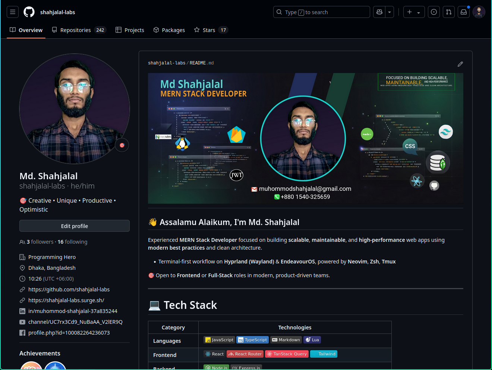
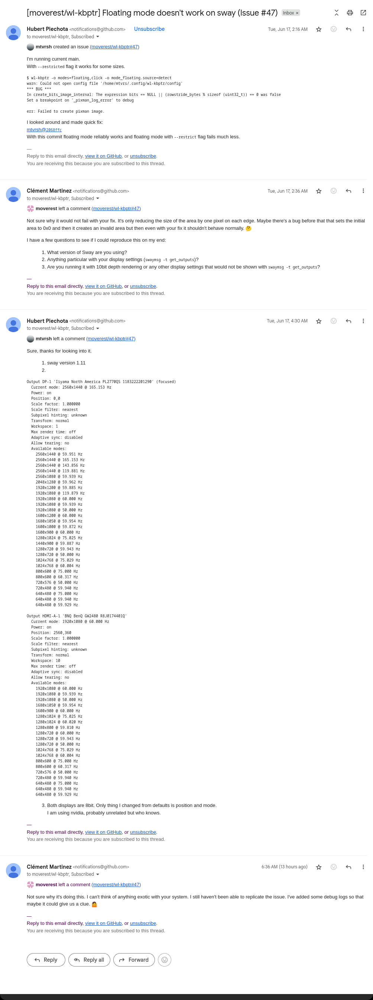
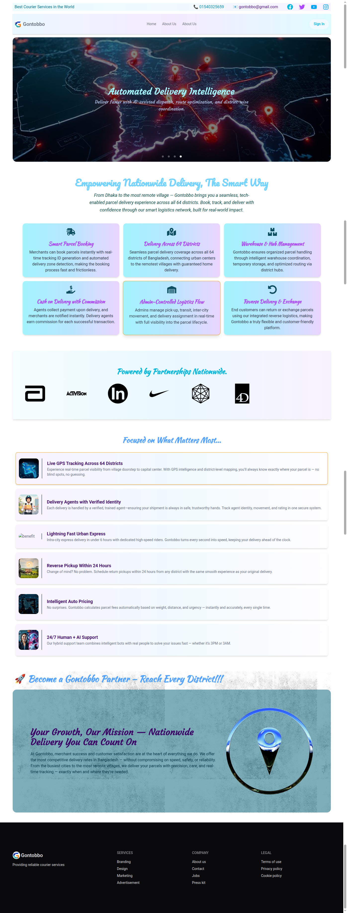
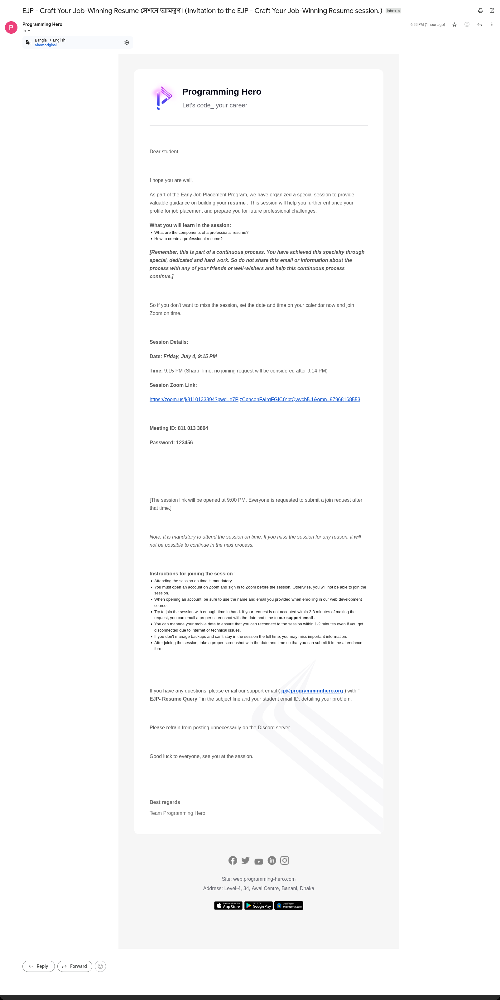

```markdown
Generate a professional, modern, and production-ready `README.md` file based on my project. Your entire output **must be enclosed within a single markdown code block** using triple backticks and `markdown` as the language. Absolutely **no text should be outside** the code block. The structure, formatting, and content should follow **industry best practices** for open-source projects, with clearly separated sections (e.g., Features, Tech Stack, Installation, Folder Structure, License, etc.).

The markdown must:
- Your entire Output must be inside one **single** markdown code block using triple backticks (```) and `markdown` as the language
- Use clear section headers (`##`) and subheaders (`###`) consistently
- Include emoji icons in section titles for modern visual appeal
- Apply bullet lists, tables, and code fences (` ``` `) for commands and code
- Be **ready to paste directly** into a markdown previewer with no extra modification
- Contain no redundant explanations or system-generated text outside the markdown block

Make sure this `README.md` looks visually appealing, easy to read, and suitable for developers on GitHub or other platforms. Output strictly in one markdown code block.


## 📁 File Structure
```bash
.
├── bun.lock
├── demo.mp4
├── eslint.config.js
├── .gitignore
├── index.html
├── package.json
├── public
│   ├── CNAME
│   └── vite.svg
├── README2.md
├── README.md
├── src
│   ├── animation
│   │   ├── auth-lottie.json
│   │   ├── index.js
│   │   ├── LottieAnimation.jsx
│   │   └── motion.js
│   ├── App.jsx
│   ├── assets
│   │   ├── Brands
│   │   │   ├── 1panel.svg
│   │   │   ├── abbott.svg
│   │   │   ├── activision.svg
│   │   │   ├── index.js
│   │   │   ├── logmein.svg
│   │   │   ├── nike.svg
│   │   │   ├── openjsfoundation.svg
│   │   │   └── tech.svg
│   │   ├── images
│   │   │   ├── a-delivery-bike-speeding-through-a-vibrant-bangladesh.jpg
│   │   │   ├── bgDesign.jpg
│   │   │   ├── finalLogo.png
│   │   │   ├── footerBg.jpg
│   │   │   ├── index.js
│   │   │   ├── location.jpg
│   │   │   ├── locationRounded.png
│   │   │   ├── locationRounded-removebg.png
│   │   │   ├── logoCircle2.png
│   │   │   ├── logoCircle.png
│   │   │   ├── logoFull.jpg
│   │   │   ├── logoFull-modified.png
│   │   │   ├── logo.jpg
│   │   │   ├── preview
│   │   │   └── profile.jpg
│   │   ├── react.svg
│   │   └── screenshots
│   │       ├── fullpage.png
│   │       ├── mobileviewFullpage.png
│   │       ├── preview
│   │       ├── ss-10-18-55-AM_28-06-25.png
│   │       ├── ss-10-19-51-AM_28-06-25.png
│   │       ├── ss-10-24-03-AM_28-06-25.png
│   │       ├── ss-10-24-25-AM_28-06-25.png
│   │       ├── ss-10-24-49-AM_28-06-25.png
│   │       ├── ss-10-25-39-AM_28-06-25.png
│   │       ├── ss-10-27-08-AM_28-06-25.png
│   │       ├── ss-10-38-51-AM_28-06-25.png
│   │       ├── ss-10-39-17-AM_28-06-25.png
│   │       ├── ss-10-39-34-AM_28-06-25.png
│   │       ├── ss-10-40-55-AM_28-06-25.png
│   │       ├── ss-10-41-19-AM_28-06-25.png
│   │       ├── ss-10-46-00-AM_28-06-25.png
│   │       ├── ss-10-46-22-AM_28-06-25.png
│   │       ├── ss-10-46-48-AM_28-06-25.png
│   │       ├── ss-10-47-08-AM_28-06-25.png
│   │       ├── ss-10-47-26-AM_28-06-25.png
│   │       ├── ss-10-47-44-AM_28-06-25.png
│   │       ├── ss-11-26-15-AM_28-06-25.png
│   │       ├── ss-11-26-35-AM_28-06-25.png
│   │       ├── ss-11-26-58-AM_28-06-25.png
│   │       ├── ss-11-27-22-AM_28-06-25.png
│   │       └── ss-11-27-45-AM_28-06-25.png
│   ├── contexts
│   │   └── AuthContext
│   │       ├── AuthContext.jsx
│   │       └── AuthProvider.jsx
│   ├── firebase
│   │   └── firebase.init.js
│   ├── hooks
│   │   ├── useAuth.jsx
│   │   └── useHelmet.jsx
│   ├── index.css
│   ├── layout
│   │   ├── AuthLayout.jsx
│   │   └── RootLayout.jsx
│   ├── main.jsx
│   ├── pages
│   │   ├── Auth
│   │   │   ├── AuthLayout.jsx
│   │   │   ├── components
│   │   │   ├── index.js
│   │   │   └── pages
│   │   ├── Authentication
│   │   │   ├── Login
│   │   │   └── Register
│   │   ├── gontobboZones
│   │   │   ├── components
│   │   │   ├── gontobbo.constants.js
│   │   │   └── GontobboZones.jsx
│   │   ├── Home
│   │   │   ├── Banner
│   │   │   ├── Benefits
│   │   │   ├── ClientLogosMarquee
│   │   │   ├── Home
│   │   │   └── Services
│   │   └── shared
│   │       ├── BrandLogo
│   │       ├── Footer
│   │       ├── Navbar
│   │       └── Spinner.jsx
│   └── router
│       ├── authRouter.jsx
│       └── router.jsx
├── structure.md
└── vite.config.js

35 directories, 81 files

```


## 📦 package.json
```json
{
  "name": "client-gontobbo",
  "private": true,
  "version": "0.0.0",
  "type": "module",
  "scripts": {
    "dev": "vite",
    "build": "vite build",
    "lint": "eslint .",
    "preview": "vite preview"
  },
  "dependencies": {
    "@tailwindcss/vite": "^4.1.10",
    "aos": "^2.3.4",
    "daisyui": "^5.0.43",
    "firebase": "^11.9.1",
    "fuse.js": "^7.1.0",
    "leaflet": "^1.9.4",
    "lottie-react": "^2.4.1",
    "lucide-react": "^0.525.0",
    "motion": "^12.19.2",
    "react": "^19.1.0",
    "react-dom": "^19.1.0",
    "react-fast-marquee": "^1.6.5",
    "react-helmet-async": "^2.0.5",
    "react-icons": "^5.5.0",
    "react-leaflet": "^5.0.0",
    "react-responsive-carousel": "^3.2.23",
    "react-router": "^7.6.2",
    "sweetalert2": "^11.22.1",
    "tailwindcss": "^4.1.10"
  },
  "devDependencies": {
    "@eslint/js": "^9.25.0",
    "@types/react": "^19.1.2",
    "@types/react-dom": "^19.1.2",
    "@vitejs/plugin-react": "^4.4.1",
    "eslint": "^9.25.0",
    "eslint-plugin-react-hooks": "^5.2.0",
    "eslint-plugin-react-refresh": "^0.4.19",
    "globals": "^16.0.0",
    "vite": "^6.3.5"
  }
}

```


## 🗺️ Routes
```js

// File: src/router/authRouter.jsx

// import AuthLayout from "../layout/AuthLayout";
import AuthLayout from "../pages/Auth/AuthLayout";
import Signin from "../pages/Auth/pages/Signin";
import SignUp from "../pages/Auth/pages/SignUp";
import Login from "../pages/Authentication/Login/Login";
import Register from "../pages/Authentication/Register/Register";

const authRouter = {
  path: "/auth",
  Component: AuthLayout,
  children: [
    {
      path: "signin",
      Component: Signin,
    },
    {
      path: "signup",
      Component: SignUp,
    },
  ],
};

export default authRouter;


// File: src/router/router.jsx

import { createBrowserRouter } from "react-router";
import RootLayout from "../layout/RootLayout";
import Home from "../pages/Home/Home/Home";
import "aos/dist/aos.css";
import Aos from "aos";
import authRouter from "./authRouter";
import GontobboZones from "../pages/gontobboZones/GontobboZones";

Aos.init();

const router = createBrowserRouter([
  {
    path: "/",

    Component: RootLayout,
    children: [
      {
        index: true,
        Component: Home,
      },
      {
        path: "gontobbo-zones",
        Component: GontobboZones,
      },
      {
        path: "chk",
        // Component: Chk,
      },
    ],
  },
  authRouter,
]);

export default router;


```


## 📄 Existing README
```md
## 📂 Project Information

| 📝 **Detail**           | 📌 **Value**                                                                                                     |
| ----------------------- | ---------------------------------------------------------------------------------------------------------------- |
| 🔗 **GitHub URL**       | [https://github.com/shahjalal-labs/client-gontobbo](https://github.com/shahjalal-labs/client-gontobbo)           |
| 🌐 **Live Site**        | [http://shahjalal-labs.surge.sh/](http://shahjalal-labs.surge.sh/)                                               |
| 💻 **Portfolio GitHub** | [https://github.com/shahjalal-labs/shahjalal-portfolio](https://github.com/shahjalal-labs/shahjalal-portfolio)   |
| 🌐 **Portfolio Live**   | [http://shahjalal-labs.surge.sh/](http://shahjalal-labs.surge.sh/)                                               |
| 📁 **Directory**        | `/run/media/sj/developer/web/L1B11/12mi/63moZapShift1/gontobbo/client-gontobbo`                                  |
| 👤 **Username**         | `sj`                                                                                                             |
| 📅 **Created On**       | `22/06/2025 06:56 পূর্বাহ্ণ রবি GMT+6`                                                                           |
| 📍 **Location**         | Sharifpur, Gazipur, Dhaka                                                                                        |
| 💼 **LinkedIn**         | [https://www.linkedin.com/in/shahjalal-mern](https://www.linkedin.com/in/shahjalal-mern)                         |
| 📘 **Facebook**         | [https://www.facebook.com/profile.php?id=61556383702555](https://www.facebook.com/profile.php?id=61556383702555) |
| ▶️ **YouTube**          | [https://www.youtube.com/@muhommodshahjalal9811](https://www.youtube.com/@muhommodshahjalal9811)                 |

---

### 🙍 Developer info:



```


## 🖼️ UI Preview Section

### 🖥️ Desktop View

#### Create

**Create Parcel**  


#### Home

**Hompage**  


**Update Page**  


### 💻 Laptop View

#### Create

**Create Parcel**  


#### Home

_No images found in Home._

#### Update

**Update Page**  


### 📱 Mobile View

_No subfolders found under 📱 Mobile View._

```